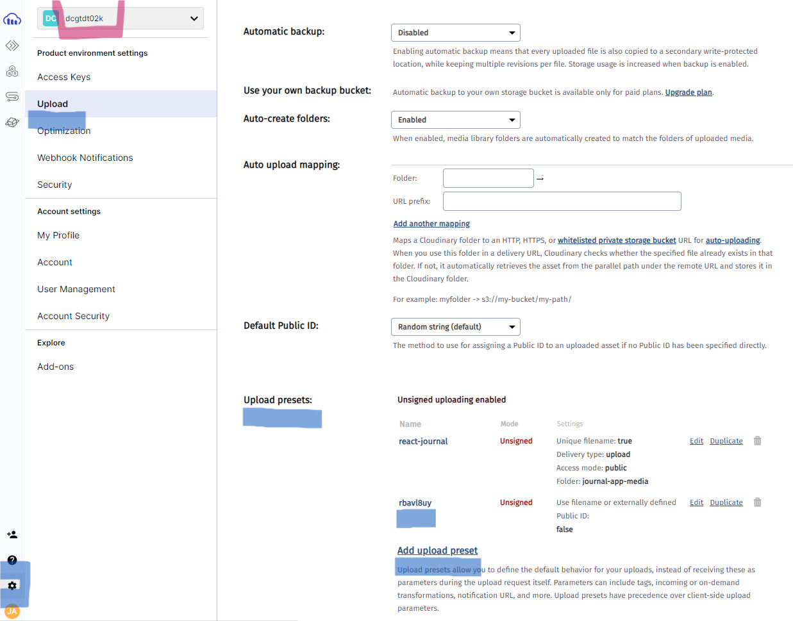
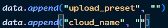

# Mini tutorial



upload_preset: ir a configuraciones, upload, en upload en la seccion upload presets agregan un nuevo preset y copiar el nombre
cloud_name: lo que esta subrayado de verde

lo anterior para rellenar en ```src/App.jsx ```


